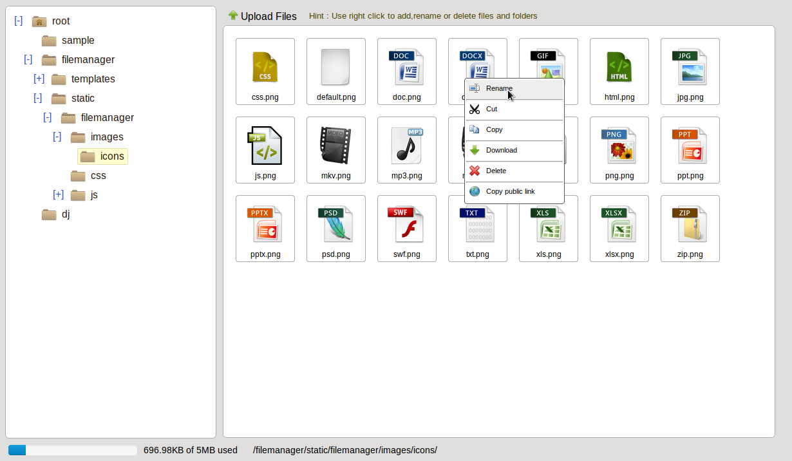

Filemanager
===========
 [](https://requires.io/github/eraymitrani/django-filemanager/requirements/?branch=master) [](https://coveralls.io/github/IMGIITRoorkee/django-filemanager)

Filemanager is a simple Django app to browse files on server.
You can also integrate this filemanager with CKEditor.

Requirements
------------

* Python (2.7, 3.4, 3.5, 3.6, 3.7)
* Django (1.8, 1.11)

Screenshot
----------



Quick start
-----------

Install it by
<pre>
pip install -e git+https://github.com/IMGIITRoorkee/django-filemanager.git#egg=django-filemanager
</pre>

Add `"filemanager"` to your `INSTALLED_APPS` setting like this::
```python
INSTALLED_APPS = (
    ...
    'filemanager',
)
```

Usage
-----

* As a filemanager : To upload files on server by a user to a directory and let him manage his directory by adding, 
renaming and deleting files and folders inside it.

* Integrating it with CKEditor for the functionality of "Browse Server".


As a filemanager
----------------

In `urls.py` of your app to make filemanager run at url `/abc/`.
```python
from django.conf.urls import url

from filemanager import path_end
from views import view

urlpatterns = (
   .
   .
   url(r'^abc/' + path_end, view, name='view'),
)
```

Then write the view in `views.py` of your app:
```python
from django.conf import settings

from filemanager import FileManager


def view(request, path):
    extensions = ['html', 'htm', 'zip', 'py', 'css', 'js', 'jpeg', 'jpg', 'png']
    fm = FileManager(settings.MEDIA_ROOT, extensions=extensions)
    return fm.render(request, path)
```
And it is done, you can find above code in `tests` directory.

Adding constraints to Filemanager : 
FileManager `__init__` is defined as:
```python
def __init__(self, basepath, ckeditor_baseurl='', maxfolders=50, maxspace=5 * 1024, maxfilesize=1 * 1024,
             public_url_base=None, extensions=None):
    """
    basepath: User's directory basepath in server.
    maxfolders: Maximum number of total nested folders allowed inside the user directory.
    maxspace (in KB): Maximum space allowed for the user directory.
    maxfilesize (in KB): Limit for the size of an uploaded file allowed in user directory.
    extensions: List of extensions allowed. Ex. ['pdf','html'] etc.
    public_base_url: A base_url if given there will be an option to copy file url with the given url_base.
    """
```
Hence one should also pass arguments like `maxfolders`, `maxspace`, `maxfilesize` if one doesn't want to use the default ones.
If extensions list is not passed then all file-extensions are allowed for upload.

Integrating with CKEditor
-------------------------

Use `filemanager.models.CKEditorField` field in you model. Or you can use `filemanager.widgets.CKEditorWidget` as a 
widget for CKEditor in forms.
Both classes can take an extra argument `filemanager_url` while making instances from them.

Suppose you want to run filemanager at url `/abc/` in your app then make changes in `urls.py` and `views.py` like above.
Then in `CKEditorField` or `CKEditorWidget` pass the url of filemanager as argument `filemanager_url`.
For example in `models.py`:

```python
from django.db import models

from filemanager.models import CKEditorField


class MyModel(models.Model):
    content = CKEditorField(filemanager_url='/app/abc/')
```
